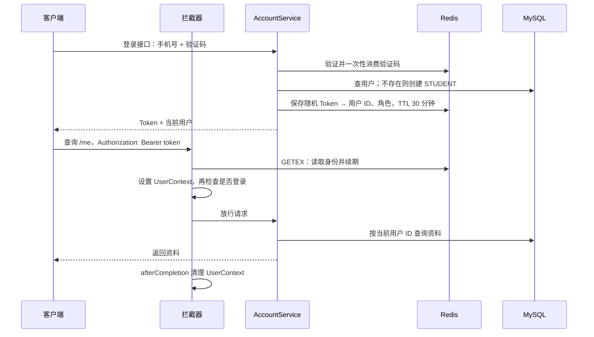

# 校园及周边活动预约平台

通过活动发现、限量报名和到场核验，连接学生与校园活动组织者。当前已完成 **Stage 1：项目基础 + Account**，22 项测试通过；活动、报名和核验仍按 [项目方案](docs/PROJECT_PLAN.md) 留在后续阶段。

这是一个 Maven 模块、一个 Spring Boot 应用。原黑马点评的源码、配置、SQL、测试、POM 和 README 原样保存在 [legacy/hmdp](legacy/hmdp)，供学习对照；不参与根项目构建，也不连接原点评数据库。

## 1. 启动与验证

需要 Java 21、Maven 3.6.3+、已启动的 Docker Desktop（Linux 容器）。在项目根目录执行：

```powershell
docker compose up -d --wait
mvn -B -ntp test
mvn spring-boot:run "-Dspring-boot.run.profiles=dev"
```

应用默认监听 `127.0.0.1:8081`，使用独立的 `campus_booking` 数据库和 `campus-booking-dev` 容器/数据卷。打开另一个终端检查：

```powershell
Invoke-RestMethod http://127.0.0.1:8081/actuator/health
```

预期为 `status: UP`。健康检查实际连接 MySQL、Redis 和 RabbitMQ。进程显示 Started 只表示 HTTP 已启动，三个外部依赖可用还需通过此检查。

| 服务 | 固定版本 | 本机端口 | 职责 |
| --- | --- | --- | --- |
| Java | 21 | — | 应用运行环境 |
| Spring Boot | 3.5.16 | 8081 | HTTP、配置、组件装配 |
| MyBatis-Plus | 3.5.17，Boot 3 starter | — | 用户持久化 |
| MySQL | 8.4.8 | 13306 | 用户、固定角色、手机号唯一约束 |
| Redis | 7.4.8 | 16379 | 验证码、冷却时间、Token |
| RabbitMQ | 4.2.5-management | 15672（AMQP）、15673（管理页） | Stage 1 只验证连接 |

Redis 客户端、MySQL 驱动和测试依赖跟随锁定的 Boot 依赖管理。版本依据：[Spring Boot 系统要求](https://docs.spring.io/spring-boot/3.5/system-requirements.html)、[MyBatis-Plus 安装说明](https://baomidou.com/en/getting-started/install/)。

构建可运行 JAR：

```powershell
mvn -B -ntp package
java -jar target/campus-booking-0.1.0-SNAPSHOT.jar --spring.profiles.active=dev
```

两种启动方式任选一种。停止应用使用所在终端的 Ctrl+C；`docker compose stop` 停止基础服务并保留数据。Compose 初始化 SQL 仅在 **空 MySQL 数据卷首次启动** 时执行，修改 SQL 不会自动更新已有表。

从旧项目继续使用 IDE 时，重新加载根目录 `pom.xml`，并把项目 SDK、语言级别和编译目标设为 Java 21。若运行时出现 `Unresolved compilation problem`，先用 `mvn clean verify -Pintegration` 清理并重建生成文件；不要通过降级业务代码处理旧编译产物。

## 2. 亲自跑通登录

`dev` 环境使用明确标记为 `DEVELOPMENT_SIMULATION` 的验证码模拟：验证码只在当前请求响应的 `devCode` 字段返回，不发真实短信，不写日志。有效期 5 分钟；同手机号 60 秒内不能重发；错误 5 次后作废；正确使用一次即删除。

```powershell
$base = 'http://127.0.0.1:8081'
$phone = '13812345678'
$receipt = Invoke-RestMethod "$base/api/account/code" -Method Post -ContentType 'application/json' -Body (@{phone=$phone} | ConvertTo-Json)
$login = Invoke-RestMethod "$base/api/account/login" -Method Post -ContentType 'application/json' -Body (@{phone=$phone; code=$receipt.data.devCode} | ConvertTo-Json)
$headers = @{Authorization="Bearer $($login.data.token)"}
Invoke-RestMethod "$base/api/account/me" -Headers $headers
Invoke-RestMethod "$base/api/account/me" -Method Patch -Headers $headers -ContentType 'application/json; charset=utf-8' -Body ([Text.Encoding]::UTF8.GetBytes('{"nickname":"校园同学"}'))
Invoke-RestMethod "$base/api/account/logout" -Method Post -Headers $headers
```

退出后再次带同一 Token 查询 `/me`，应收到 HTTP 401。重复运行整个示例如果返回 429，等待验证码冷却时间结束。

新手机号首次登录创建 STUDENT。开发初始化脚本提供组织者手机号 `13900000000`，使用同样的验证码流程登录。角色来自 MySQL；公开请求不能提交 `role`、用户 ID 或替他人修改资料。Stage 1 基本资料仅开放昵称修改；手机号是登录标识。

| 接口 | 登录要求 | 请求/行为 |
| --- | --- | --- |
| `POST /api/account/code` | 无 | `{"phone":"13812345678"}`，取得开发验证码 |
| `POST /api/account/login` | 无 | `phone`、`code`，返回 Token、有效期和用户 |
| `GET /api/account/me` | 有 | 从数据库获取当前用户资料 |
| `PATCH /api/account/me` | 有 | 仅接受 `nickname`，去掉首尾空格后保存 |
| `POST /api/account/logout` | 有 | 删除当前 Token；不删除其他设备的 Token |
| `GET /actuator/health` | 无 | 基础服务健康检查，只公开总状态 |

业务接口统一响应 `{"code":"OK","message":"操作成功","data":...}`；错误使用对应 HTTP 状态：400 参数/验证码错误、401 未登录/Token 失效、429 验证码请求过频、503 外部依赖不可用或短信未配置。客户端不应记录验证码或 Token，也不要把过期 Token 附带到重新登录请求。

## 3. 项目地图与请求生命周期

```text
src/main/java/com/campusbooking/
├── CampusBookingApplication.java   # 应用入口
├── account/
│   ├── AccountController.java      # 接收参数与返回响应
│   ├── AccountService.java         # 登录、用户和资料规则
│   ├── auth/                      # Redis 登录状态、两个拦截器、UserContext
│   ├── dto/                       # HTTP 输入输出结构
│   ├── mapper/                    # 数据库访问
│   └── model/                     # 用户与固定角色
├── common/                        # 响应与必要异常处理
└── config/                        # 拦截器注册顺序与路径
src/main/resources/                # 配置、建表 SQL、验证码原子脚本
src/test/java/                     # 业务、请求生命周期、隔离集成测试
docker/mysql/                      # 开发组织者初始化数据
legacy/hmdp/                       # 原项目学习参考
```

旧登录流程以点评用户、Redis 用户快照和通用技术目录组织；新流程以 Account 业务集中组织，补上验证码一次性消费、手机号唯一约束、固定角色、退出及可验证的异常清理。Controller → Service → Mapper/Redis 的依赖方向保持清晰，没有为每个 Service 增加只有一个实现的接口。



**Interceptor（拦截器）**在 Controller 执行前统一处理身份。第一个负责恢复身份和续期，第二个只决定受保护接口能否放行。

**ThreadLocal**为当前请求线程保存一份用户身份，使业务代码不必层层传递 HTTP 请求对象；线程会复用，所以结束时必须 `remove()`。参数校验失败、业务异常也需清理。它不自动跨线程传递，不应在未来异步消费里读取 HTTP 用户上下文。

**DTO**是接口专用的输入输出结构；资料更新 DTO 没有 `role`、`id` 或 `phone`，避免把数据库实体直接作为可任意修改的请求。Service 使用构造器接收 Mapper 和 Redis 组件，由 Spring 创建并传入，这就是当前项目中的**依赖注入**。

## 4. 关键设计取舍

| 决策 | 解决的问题与收益 | 代价和边界 |
| --- | --- | --- |
| Redis 存随机 Token，只保存 ID、角色 | 续期和退出直接操作登录状态；资料修改不用同步所有 Token | 请求依赖 Redis；30 分钟是空闲过期时间，活跃请求会续期 |
| GETEX 原子读取并续期 | 过期/退出后不因续期重新创建 key | 已通过校验、正在执行的请求不会被退出操作中断 |
| 验证码小型 Lua 脚本 | 并发校验最多消费一次，失败次数与冷却判断有确定边界 | 仅验证码原子操作；报名 Lua 留在 Stage 3，不承诺 Redis/MySQL 全局事务 |
| MySQL 手机号唯一约束 | 并发创建用户时数据库兜底，只保留同一用户 | 遇到唯一键冲突需要重新查询；不能只依赖先查后写 |
| 新用户固定 STUDENT，组织者通过受控 SQL 配置 | 客户端不能自行提权 | 没有角色管理接口；Token 中角色是登录时快照，人工改角色后需撤销相关 Token 并重新登录 |
| 单条用户写入提交后再创建 Token | 登录凭证不会指向未提交用户；不引入多表事务 | Redis 签发失败时可能已建用户但未完成登录；重新取码后复用用户 |

验证码校验成功后若 MySQL 或 Redis 发生故障，验证码已被消费，需要冷却结束后重新取码。多个系统之间没有全局事务，也不在 Stage 1 建立补偿平台。短信模拟是本机学习功能；非 `dev`/`test` profile 不允许启用模拟，默认短信未配置时返回 503。

## 5. 配置与环境

- `application.yaml`：公共配置及默认行为；真实凭据从环境变量进入。
- `application-dev.yaml`：与 Compose 对应的本机示例凭据和短信模拟。
- `.env.example`：Compose 参数示例。Compose 自动读取 `.env`，Spring Boot **不自动读取**该文件；修改凭据/端口后，需要给应用设置同名环境变量。
- `src/main/resources/db/schema.sql`：正式用户表结构；应用正常启动不自动修改数据库。
- `docker/mysql/02-dev-organizer.sql`：仅开发环境种子用户，不在测试或其他环境自动执行。

常用环境变量：`SERVER_PORT`、`SERVER_ADDRESS`、`DB_URL`（完整 JDBC URL）、`DB_USERNAME`、`DB_PASSWORD`、`REDIS_HOST`、`REDIS_PORT`、`REDIS_PASSWORD`、`RABBITMQ_HOST`、`RABBITMQ_PORT`、`RABBITMQ_USERNAME`、`RABBITMQ_PASSWORD`、`RABBITMQ_VHOST`。Compose 使用 `DB_PORT` 改 MySQL 映射端口时，应用须对应设置 `DB_URL`。默认只绑定本机回环地址；示例凭据只适合本机开发。

Token、验证码有效期和失败次数在 `app.account` 下配置。异常日志只记录必要错误类型；登录/退出记录用户 ID，不记录请求体、验证码或完整 Token。RabbitMQ 没有报名队列或消费者，健康检查仅建立连接。

## 6. 测试与复现顺序

```powershell
# 12 项业务/请求生命周期测试，不依赖外部服务
mvn -B -ntp test

# 包含上面测试，另建独立容器运行完整链路，再打包验收
mvn -B -ntp verify -Pintegration
```

集成测试通过 Testcontainers 创建随机端口、独立数据的 MySQL、Redis、RabbitMQ；仅清理这组临时服务的数据，结束后自动回收。Docker 不可用时直接失败，不把集成测试静默跳过。报告在 `target/surefire-reports` 与 `target/failsafe-reports`。首次执行需要下载依赖与镜像。

| 顺序 | 亲自阅读/复现的文件 | 工程意义与可观察验收 |
| --- | --- | --- |
| 1 | `pom.xml`、`compose.yaml`、`application*.yaml`、启动类 | 搞清配置如何接入服务；应用启动且健康检查 UP |
| 2 | `db/schema.sql`、`account/model`、`AccountMapper` | 定义用户事实与约束；重复手机号无法插入 |
| 3 | `AccountService`、`AccountRedisStore`、`redis/*.lua` | 实现验证码 → 用户 → Token；错误码拒绝、正确码只用一次 |
| 4 | `RefreshTokenInterceptor`、`LoginInterceptor`、`UserContext`、`WebConfig` | 恢复身份 → 校验 → 清理；访问续期、匿名拒绝、异常后无身份残留 |
| 5 | `AccountController`、`dto`、`AccountFlowIT` | 确定接口边界；资料可修改、客户端不能传角色、退出后 401 |

这一阶段的目标是能画出登录与后续请求的完整数据流，并独立复现一个“验证码登录 + /me + 退出”的最小版本。

- 必须理解：MySQL 用户事实与 Redis 登录态的边界、拦截器顺序、ThreadLocal 清理、接口参数边界（优先级 10/10）。
- 学会使用即可：Spring 注解、MyBatis-Plus 单表 API、Compose 常用命令（7/10）。
- 可交给 AI：实体 getter/setter、响应样板和重复测试请求构造（3/10）。

思考题：为什么改昵称不用重写所有 Token？为什么退出后不能保证已经在执行的请求被中断？如果删除手机号唯一约束，并发创建用户时会出现什么结果？

实际执行结果见 [项目方案第 10 节](docs/PROJECT_PLAN.md#10-当前交付状态)。Stage 2 仍需收到后续实施指令。
