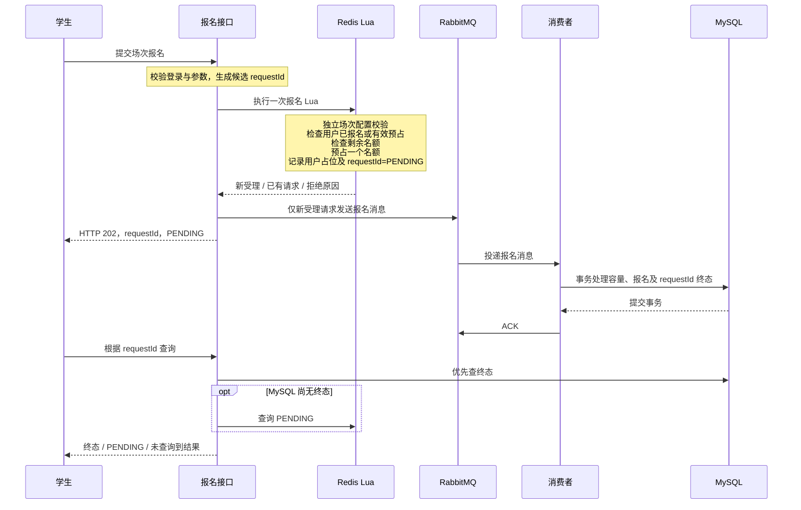

# 校园及周边活动预约平台：第一版方案

方案固化日期：2026-09-06；五个 Stage 路线更新日期：2026-09-07。

本文件描述已确认的目标设计；Stage 1～3 已完成。Stage 3：Registration 于用户 2026-09-20 授权后实施并通过验收，具体交付与验证状态见第 10 节；Stage 4～5 仍等待后续实施指令。

## 1. 目标与范围

以现成项目的业务场景为参考，实现一个适合 Java 后端本科生深入理解、独立复现，并能够作为实习/校招项目展示的单体后端。

业务主线：

```text
组织者发布活动及场次
  → 学生发现附近活动
  → 开放限量报名
  → 学生查询报名结果并取得凭证
  → 组织者核验到场
  → 查看参与记录与到场名单
```

第一版采用免费、固定容量的场次报名。只有固定的学生（STUDENT）、组织者（ORGANIZER）角色及资源归属检查，不建设复杂权限平台。

| 模块 | 第一版职责 |
| --- | --- |
| account | 验证码登录、Redis token、续期、退出、获取当前用户、基本资料、固定角色；短信发送可先使用明确标注的开发模拟 |
| activity | 地点、活动、场次、报名时间与容量、发布、分页、详情缓存、GEO 附近查询 |
| registration | requestId、Lua 原子受理、RabbitMQ 异步处理、报名结果、我的报名、消费幂等 |
| participation | 凭证核验、组织者权限、核验时间窗口、重复核验保护、MySQL 参与记录、到场名单 |

不加入新业务模块。关注、Feed、点赞、反馈社区、连续签到、跨月 Bitmap、UV、支付退款、候补、选座、复杂场地排期及取消后的自动名额返还不属于第一版。


## 2. 结构与技术边界

- 一个 Maven 模块、一个 Spring Boot 应用，按上述四个业务模块组织代码。
- Controller 负责 HTTP 参数与响应；Service 负责业务规则和事务；Mapper 负责数据库访问。
- RabbitMQ Listener 调用 registration 的 Service，不自行堆积报名和容量规则。
- Java 21、Spring Boot 3.x、MyBatis-Plus、MySQL、Redis、RabbitMQ、Docker Compose；必要的 JUnit、MockMvc 和隔离服务集成测试。
- Spring Data Redis 与 Lettuce 优先跟随 Boot 管理版本。缓存重建需要锁时，使用已经约定的 Redisson，不增加锁平台。
- 具体兼容补丁版本在实施阶段固定，不使用浮动的 latest 镜像，不增加其他技术栈。
- 时间戳 + Redis INCR 只作为一个小型 ID 生成工具。统一时间基准和序列规则，说明时钟及 Redis 数据保留前提，不建设独立 ID 服务。
- 正式缓存先做回源、短期空值、随机 TTL 和互斥重建；逻辑过期仅保留为后续对照实验。展示缓存的短 TTL 与下文报名运行状态的长生命周期是两回事。

## 3. 固定的限量报名主链路



图中的正常投递流程不代表跨 Redis、RabbitMQ、MySQL 的全局事务。发送前宕机等风险见第 8 节。

### 3.1 Lua 原子动作

一次 Lua 调用完成全部资格与预占动作，不拆成多次独立 Redis 请求：

1. 验证报名运行配置存在、可用，且当前处于报名窗口。
2. 检查用户是否已有报名占位或有效预占；存在则返回原 requestId。
3. 检查可预占名额大于零。
4. 扣减一个可预占名额。
5. 记录用户与本次 requestId 的占位关系。
6. 写入该 requestId 的 PENDING、用户、场次和受理时间，并设置规定的绝对到期时间。

所有校验尽量放在写入之前；使用显式 KEYS 和固定数据类型约定。Lua 原子执行不等于脚本出错时自动回滚，实施时要测试参数及 key 类型错误，不能把脚本异常笼统解释为完全没有副作用。

重复提交生成的候选 ID 不成为新报名操作：Lua 返回已有 requestId，不再扣名额、不创建第二条 PENDING，也不把重复提交当作隐藏的消息补发入口。

只有 Lua 返回“新受理成功”才发送 MQ。发送前不写 MySQL 报名请求表或结果表。

## 4. 边界一：Redis 运行状态生命周期

### 4.1 统一绝对到期时间

设：

```text
sessionEndAt = MySQL 已发布场次的结束时间
buffer = 初始 24 小时，可通过配置调整
expireAt = sessionEndAt + buffer
```

场次报名配置、可预占名额、用户占位及其 requestId PENDING，均保留至这个统一的 expireAt。它是绝对时刻，不是“从每次请求起再计时 24 小时”。

- 不采用几秒或几分钟的预占 TTL。
- 不做自动超时释放，也不因为用户轮询或重复提交而延长到期时间。
- 受理时使用报名运行配置内已经确定的 expireAt，不能让不同请求自行计算不同保留策略。
- 运行状态的 buffer 在场次发布时确定；后续应用配置变化不能缩短已有场次状态的保留期。
- 用户占位不能比仍有效的报名处理消息更早失效，否则相同用户可能重新预占，而旧消息随后继续完成。
- 发布时初始化运行状态的到期时间；报名 Lua 新建 PENDING 或用户占位键时使用同一 expireAt，不延长场次状态寿命。

长保留期是为异步处理保留去重和查询依据，不代表第一版承诺在缓冲期内自动恢复所有请求。

### 4.2 有限保留必须配合消息的业务截止边界

仅设置“场次结束后 24 小时过期”还不够：队列中的消息、未 ACK 消息或死信可能保存更久。因此第一版明确：

- 场次结束后，尚未完成的请求不再允许创建新的成功报名。
- 消费者先查询 requestId 既有终态；已有 SUCCESS/FAILED 直接复用，不因消息迟到改写结果。
- 没有终态时，在业务事务中根据 MySQL 场次结束时间检查截止条件；已过期只能保存明确的 FAILED 结果，不能继续扣容量或建单。
- 场次结束前已进入消费事务的处理必须有事务和操作超时边界。buffer 必须大于最长允许处理时间并留出合理时钟偏差，确保 Redis 到期前这些处理已经结束。
- 若以后改变消费截止或执行时限，必须一并检查状态保留期。不能允许消息无限期成功执行，同时提前删除去重状态。
- MQ 消息 TTL 不能单独证明处理已经结束，因为已投递而未 ACK 的消息仍可能正在执行。
- 第一版没有自动死信重放。将来即使人工重放旧消息，也必须经过同样的截止与终态检查。

这里没有增加新的恢复系统，只是给既有消息消费确定有效时间范围。

### 4.3 到期与失败不是同一件事

- Redis 到期仅表示清理运行状态，不表示自动退款、自动归还名额或允许重新报名。
- 不因查询超时、MQ 确认超时、死信或 key 缺失推断报名已失败。
- 已持久化的 MySQL 终态、报名记录、核验记录不随 Redis TTL 删除。
- 第一版不要求消费者在 Redis 再保存 SUCCESS/FAILED。既有 PENDING 和用户占位可以保留至 expireAt；MySQL 终态在查询时优先覆盖暂态解释。
- 无论报名最终成功还是明确失败，第一版均不靠删除用户占位开放自动重新报名，也不实现自动名额回补。

## 5. 边界二：Lua 的独立场次配置来源

### 5.1 配置事实与展示缓存分离

MySQL 保存场次业务配置。activity 模块在发布时，将配置初始化到专门的 Redis 报名运行状态。Lua 不读取活动详情展示缓存。

报名运行配置至少包括：

| 字段 | 含义 |
| --- | --- |
| sessionId | 场次标识 |
| enabled | 是否允许受理报名 |
| registrationStartAt / registrationEndAt | 报名开放与关闭时间 |
| sessionEndAt | 场次结束时间，也是迟到消费的业务截止依据 |
| available | Redis 当前可预占名额 |
| expireAt | 本场次统一运行状态到期时间 |

独立数据可按以下逻辑划分，具体 key 命名在实施时统一：

| 逻辑键 | 内容 |
| --- | --- |
| registration:session:<sessionId>:runtime | 运行配置及当前 available |
| registration:session:<sessionId>:users | userId → 已受理 requestId 的占位关系 |
| registration:request:<requestId> | PENDING、userId、sessionId、acceptedAt、expireAt |

requestId 对应的独立键使客户端只凭 requestId 就能查询暂态，无需依赖额外的全局索引。查询仍必须校验当前用户身份。

详情展示缓存、GEO 索引和上述报名运行状态有不同职责，修改展示缓存不能顺带删除报名运行键。

### 5.2 场次发布时的同步

1. 在 MySQL 中校验并保存场次配置。报名开始时间应晚于发布操作，时间顺序和正容量必须合法。
2. 数据库发布事务提交后，以已保存的配置原子初始化 Redis 运行字段、初始可预占名额和 expireAt；不能先开放 Redis 再提交配置。
3. Lua 仅接受配置完整且 enabled 的场次。缺失或未完成同步时明确拒绝新受理，不能回退到活动展示缓存。
4. 发布接口只有在 Redis 初始化完成后才报告“发布完成且可按计划报名”。MySQL 已保存但 Redis 同步失败时，明确报告“配置已保存，报名运行配置同步未完成，暂不可报名”。
5. 同步失败不假装数据库也已经回滚。第一版允许在尚未开放报名时，由组织者显式重试同一个发布操作，不建设后台同步或恢复平台。
6. 初始化必须具有重复执行保护：配置一致且已存在时确认已有结果，不重置 available，不删除用户占位或 PENDING；存在冲突时报告错误。
7. 仅可在能够确认尚未开放、未受理报名的情况下初始化缺失状态。已进入报名期后丢失运行键时拒绝受理，不根据 MySQL 剩余容量自动覆盖重建，因为它不包含所有 Redis 未完成预占。

### 5.3 场次修改时的规则

为使第一版同步边界可理解，不支持已发布场次的动态扩容和时间调整：

| 修改时机/内容 | MySQL 与 Redis 的处理 |
| --- | --- |
| 草稿阶段修改容量、报名窗口、场次时间 | 只修改 MySQL；草稿没有开放的报名运行状态，发布时读取最新完整配置 |
| 已发布后修改活动标题、介绍、图片等展示内容 | 修改 MySQL，提交后失效展示缓存；不改报名配置、库存、用户占位或 PENDING |
| 已发布后修改容量、报名窗口、场次结束时间 | 第一版拒绝此类修改；需要不同规则时创建新场次 |

发布与草稿编辑必须受同一数据库状态校验保护，不能在发布提交后继续按草稿覆盖核心配置。地点、时间等已经对报名者产生承诺的场次信息同样不在发布后随意变更。

应用启动、详情读取、普通数据更新不得执行全量 SET 覆盖已有报名库存。展示缓存的回源策略不能复用于报名库存重建。

## 6. 边界三：requestId 终态模型

### 6.1 Redis 保存暂态，MySQL 保存终态

报名结果使用 registration 模块内的一张轻量结果表，暂名 registration_result：

| 字段 | 约束/职责 |
| --- | --- |
| request_id | 主键或唯一键；标识该次受理操作 |
| user_id / session_id | 校验查询归属、关联用户和场次 |
| status | 仅 SUCCESS 或 FAILED，不存发送前 PENDING |
| registration_id | SUCCESS 对应的正式报名记录；FAILED 为空 |
| failure_code | FAILED 的明确业务原因；SUCCESS 为空 |
| completed_at | 处理完成时间 |

此表由消费者处理后写入，既不是发送前的请求落库，也不是 Outbox、发送任务表或重试任务表。

正式报名表还应具有 request_id 唯一约束，以及 (user_id, session_id) 业务唯一约束。两种约束分别保护重复消息和同一用户对同一场次的重复报名。

### 6.2 消费者事务与 ACK

- 已有终态：复用结果并 ACK，不重新扣容量或创建报名。
- 新的成功处理：数据库条件扣减容量、创建正式报名、插入 SUCCESS 结果必须在同一事务提交。
- 容量不足、超过业务截止时间等确定的业务拒绝：保存 FAILED，且保证没有容量变化或部分报名残留。
- 若在写入过程中发生冲突或错误，先完整回滚；不能在一个已经回滚或标记回滚的事务里假装保存 FAILED 成功。
- 并发唯一键冲突需要在回滚后读取已提交事实：相同 requestId 已有结果就复用；不同 requestId 触发同一用户/场次约束时，才能按明确业务事实记录本请求失败。不得覆盖已经提交的 SUCCESS。
- 数据库不可用、连接中断、未知提交结果等技术异常不等于业务失败，不能凭捕获到异常就生成 FAILED。
- 只有所需终态及相关业务数据已提交，才 ACK。技术异常按基础死信方案处理，不无限重新入队。
- 终态提交后不修改为另一终态；核验状态属于正式报名/参与记录，不扩展 requestId 状态机。

### 6.3 查询顺序

```text
已登录用户 + requestId
  → 查 MySQL registration_result
      → 存在：校验归属，返回 SUCCESS/FAILED
      → 不存在：查 Redis requestId
          → 存在且属于当前用户：返回 PENDING
          → 不存在：返回“未查询到结果”，不能解释为 FAILED
```

不能因为 Redis 中还保留 PENDING 而遮蔽 MySQL 已提交的 SUCCESS/FAILED。

MySQL 查询失败时，应报告查询服务暂不可用并保留原 requestId，而不是将“数据库故障”当成“没有终态”后返回错误结论。

没有终态且 Redis 记录已经到期时，查询接口仍不鼓励客户端创建新请求；第一版只陈述当前无法查到最终结果。

## 7. 边界四：MQ 发送异常时的接口语义

### 7.1 已受理与报名成功分开

requestId 一旦由成功 Lua 写入 PENDING，就成为该次报名操作的唯一查询凭证。接口返回含义是“已经受理”，不是“已经报名成功”。

| 情况 | 返回语义 |
| --- | --- |
| Lua 明确拒绝，未产生预占/PENDING | 返回未受理及具体原因，例如重复之外的名额不足、未开放 |
| Lua 新受理成功，MQ 发送正常或已确认 | HTTP 202，原 requestId，PENDING；通过查询获知终态 |
| Lua 新受理成功，发送 MQ 抛异常 | HTTP 202，原 requestId，PENDING；说明投递尚未确认，不声称报名失败 |
| Lua 新受理成功，Publisher Confirm 超时或否定确认 | 原 requestId 仍有效，记录投递异常；不推导 FAILED，不要求重新提交 |
| Lua 检测到已有有效占位 | 返回已有 requestId 供查询；不生成第二次受理，不自动补发 MQ |

建议响应示例：

```json
{
  "requestId": "123456789012345678",
  "status": "PENDING",
  "message": "请求已受理，尚未获得最终报名结果，请保留 requestId 查询。"
}
```

发送异常时可以将 message 改为“请求已受理，消息投递暂未确认，请保留该 requestId 查询；无需重新提交”。不把 MQ 异常暴露为会触发新报名的通用失败重试提示。

requestId 在 HTTP JSON 中用字符串表示，避免长整数在客户端解析时损失精度；这不引入新的 ID 系统。

### 7.2 错误处理与客户端约定

- Lua 已成功后的 MQ 异常需要由报名接口边界捕获，不能继续冒泡到全局异常处理并返回“报名失败，请重试”。
- 异步 Confirm 回调关联原 requestId 记录日志，不能修改已经发出的 HTTP 响应，也不新增另一 requestId。
- 启用 Publisher Confirm，并检测不可路由消息；broker 确认不等于消费者已完成报名。
- 客户端受理后保存 requestId，切换为查询操作，不因为 PENDING 或投递告警反复创建报名。
- 如果受理后 HTTP 响应丢失，用户再次提交时，Lua 的用户占位检查返回原 requestId；不重复预占。
- 如果 Lua 执行本身网络超时，不能确定脚本是否成功，也应保留候选 requestId 并提示查询，不声称“肯定未受理”。本节的固定 HTTP 202 保证针对已经确认 Lua 成功的情况。
- 第一版不因为 MQ 发送异常自动回滚 Redis 名额或删除用户占位；确认超时并不能证明消息没有被接收。
- 受理后可能长期没有终态，这是已知限制，不通过误导性错误文案隐藏。

## 8. 第一版可靠性边界

保留 Publisher Confirm、Consumer ACK、消费幂等、数据库事务和唯一约束、持久化消息及队列、基础死信队列和必要日志。

| 故障窗口 | 第一版结果/处理 |
| --- | --- |
| Lua 已成功，应用在 MQ 发送前宕机 | Redis 留下预占和 PENDING，可能无消费者处理；不自动恢复 |
| MQ 发送或确认结果不确定 | 保留 requestId、预占与查询语义，记录异常，不盲目释放名额 |
| 数据库提交后 ACK 丢失 | 消息可能重复到达，由 MySQL 终态与唯一约束去重 |
| 消费技术异常 | 消息进入基础死信队列供检查，不无限重投，不直接推导 FAILED |
| Redis 运行状态丢失 | 不自动从 MySQL 余量覆盖重建活动中的库存；拒绝无运行配置的报名 |
| 暂态到期仍无 MySQL 终态 | 结果可能不可查询；不伪造失败，不允许过期消息再创建成功报名 |

不实施 Outbox Pattern、Saga、分布式事务框架、通用补偿平台、通用重试平台、自动库存对账、自动重放或复杂故障恢复。

未来可考虑 reconciliation：核对 Redis 预占、消息和 MySQL 结果后修复差异。它仅是已知风险的后续方向，不是第一版实现任务。

## 9. 固定的五个 Stage

实施顺序固定为：

```text
Stage 1：项目基础 + Account
  → Stage 2：Activity + Redis Cache + GEO
  → Stage 3：Registration + Lua + RabbitMQ + MySQL 事务与幂等
  → Stage 4：Participation + 核验与业务闭环
  → Stage 5：测试 + 压测 + 日志 + Docker + README + 架构图
```

每阶段交付均须能够编译、启动，并通过该阶段的必要测试。测试随业务实现建立，Stage 5 负责集中补齐、整理与测量，不把基本正确性留到最后才验证。下面的验收项是未来实施标准，不代表当前已经实现或测得。

### 9.1 Stage 1：项目基础 + Account

目标是先跑通一个现代 Spring Boot 应用和完整登录请求生命周期，保持这一阶段轻量。

实现顺序：

1. 建立 Java 21、Spring Boot 3.x 的单模块项目结构，整理必要依赖及环境配置；具体兼容版本在此阶段锁定。
2. 使用 Docker Compose 启动 MySQL、Redis、RabbitMQ，完成应用连接验证。RabbitMQ 此时只接通基础环境，报名队列与消费者在 Stage 3 实现。
3. 建立用户数据与固定 STUDENT / ORGANIZER 角色，完成验证码 → 登录 → Redis Token → 续期 → 退出 → 获取当前用户的链路。
4. 通过 Interceptor 处理请求身份，以 ThreadLocal / UserContext 向业务传递当前用户，在请求结束时清理上下文。
5. 增加当前登录链路需要的参数校验、异常响应、必要日志和测试，不提前建设通用权限、消息或基础设施平台。

重点理解项目结构与配置如何驱动启动、Docker 基础服务如何接入、Token 在 Redis 中如何保存与续期，以及用户身份如何随一次 HTTP 请求进入和离开业务代码。验证码发送可以先采用明确标注的开发模拟，不要求接入真实短信服务。

验收：应用能够编译并按说明启动，三个基础服务可连接；验证码正确/错误、登录、续期、过期、退出和当前用户查询行为可验证；未登录访问受保护接口被拒绝；请求结束后没有用户上下文残留，日志不泄露验证码或完整 Token。

Stage 1 实施约定（2026-09-07）：

- 根目录为新应用的唯一构建入口；原源码、配置、SQL、测试、POM 和 README 原样归档至 `legacy/hmdp`，不参与新应用编译和测试。
- 版本锁定为 Java 21、Spring Boot 3.5.16、MyBatis-Plus 3.5.17；Compose 固定 MySQL 8.4.8、Redis 7.4.8、RabbitMQ 4.2.5-management。Spring Data Redis、Lettuce、驱动和测试工具跟随 Boot 管理版本。
- 验证码 5 分钟有效、60 秒发送冷却、最多 5 次错误；正确校验后一次性消费。仅 `dev`/`test` 可启用模拟并在响应中返回验证码，日志不输出验证码或完整 Token。
- Token 是随机不透明字符串，Redis 保存用户 ID 与固定角色；空闲有效期 30 分钟，拦截器通过 GETEX 原子读取并续期，请求结束清理 UserContext。
- 新用户固定 STUDENT；组织者仅通过受控数据库数据设置，Compose 提供一个开发示例。基本资料目前仅允许修改昵称，角色、手机号和用户 ID 不作为资料修改输入。
- 用户创建先在 MySQL 提交，再签发 Redis Token；单条写入无需额外多表事务。验证码消费后的技术失败可能要求重新取码，不声称跨 Redis/MySQL 全局原子性。
- RabbitMQ 仅接通环境和健康检查，报名拓扑、消费者与消息可靠性规则留在 Stage 3。

### 9.2 Stage 2：Activity

目标是让活动发布与发现成为真实业务，并深入学习有实际访问场景的缓存。

实现顺序：

1. 用 MySQL 建立地点、活动、场次及归属关系，完成组织者创建活动 → 创建场次 → 发布，校验角色、归属、容量和时间。
2. 发布时按第 5 节初始化独立 Redis 报名运行配置，为 Stage 3 提供确定的配置来源；保留发布后核心配置冻结和重复初始化保护。
3. 完成学生端活动列表、分页和详情查询，先验证数据库查询结果，再接入详情缓存。
4. 实现 Cache Aside：读缓存 → 未命中查 MySQL → 写回缓存；用短期空值处理不存在的数据、随机 TTL 分散集中失效、Redisson 缓存重建锁限制热点失效时的并发回源；更新提交后使展示缓存失效。
5. 使用 Redis GEO 按地点查询附近活动，使地理索引对应实际活动发现需求。

重点理解缓存命中、未命中、空值、过期和更新的完整数据流，以及缓存重建锁的收益与代价。详情展示缓存、GEO 索引、报名运行状态各自承担已有职责，不能共用库存重建逻辑。

验收：组织者可以发布自己的活动，学生能查列表、详情和附近活动；越权修改被拒绝；缓存命中与回源可观察，不存在的数据能被短期缓存，热点缓存失效时不会让所有请求同时回源；展示更新后可读到新内容；附近查询符合给定地点与距离条件；运行配置同步失败、重复发布和发布后核心配置编辑遵守第 5 节。

Stage 2 实施约定（2026-09-12）：

- 一个活动关联一个固定地点，含多个场次。组织者可创建共享地点，地点无修改/删除接口；活动创建后地点固定。场次 DRAFT/PUBLISHED 是发布事实，学生列表和详情仅显示含已发布场次的活动；不据此推断当前可报名或尚有余量。
- 报名时间满足：当前时间 < 报名开始 < 报名结束 <= 场次开始 < 场次结束；统一为 UTC 毫秒精度。发布时将 runtimeExpireAt 固化到 MySQL，配置变化及重复发布均不重新计算已有场次的缓冲期。
- 发布与草稿编辑在 MySQL 事务中锁定同一活动行。事务提交后初始化 Redis；完整匹配已有运行配置时仅返回确认结果，不修改 available 或 TTL。缺失状态只能在 Redis 服务端时间尚未到报名开始、且不存在用户占位时初始化。
- 使用 Redisson 3.52.0 核心客户端，仅负责活动展示缓存锁；Lettuce/StringRedisTemplate 继续负责 Account 与业务 Redis 数据，不替换现有客户端。重建锁也覆盖展示变更的事务提交与删除缓存，避免旧回源结果在失效后写回。
- 活动详情使用 10 分钟 + 0～2 分钟随机 TTL，空值缓存 30 秒，默认等锁上限 3 秒；等待超时返回 503，不绕过锁集中回源。已发布列表分页直接查 MySQL。
- 发布分别返回 runtimeReady、geoReady、displayReady；任何一步同步未完成返回 503 并明确数据库已保存。组织者可显式重试同一发布；无后台自动修复。展示缓存失效失败时旧内容可能保留至 TTL 到期。
- GEO 以地点 ID 建索引，发布时写入；先查半径内全部地点，再按距离顺序查询对应已发布活动并分页。附近半径限制 (0,50] 公里，分页 size 最大 50；适合当前校园规模，不实现城市级海量地点检索。
- 新增三张表，既有用户表与登录链路保持职责不变。已有开发卷需要显式执行增量建表；正常应用启动不自动改表。启动验收及故障测试使用临时容器，开发数据不作为测试夹具。

### 9.3 Stage 3：Registration

这是项目的技术核心，重点投入 Lua 原子受理、MQ 削峰、MySQL 最终事实和消费幂等。

```text
用户报名 → 候选 requestId
  → 一次 Redis Lua：场次与窗口校验、防重复、名额预占、用户占位、PENDING
  → RabbitMQ → Consumer → MySQL Transaction
  → SUCCESS / FAILED → requestId 查询
```

实现顺序：

1. 确定报名与结果表的约束、requestId 查询接口，以及时间戳 + Redis INCR 小型 ID 工具。
2. 基于 Stage 2 的独立运行配置，实现一次 Lua 原子受理。发送 MQ 前不写 MySQL 报名请求或结果记录。
3. 接入持久化消息与队列、Publisher Confirm（生产者发布确认）、不可路由检测和基础死信队列，保持第 7 节的受理响应语义。
4. Listener 调用业务 Service，在 MySQL 事务中处理容量、正式报名和 SUCCESS/FAILED 终态；以唯一约束与既有终态保证重复消费不重复扣容量，事务提交后才 Consumer ACK。
5. 完成结果查询、我的报名及受理至消费的 requestId 日志关联，并测试并发、重复投递、事务回滚与已确认的故障边界。

重点解释 Redis 预占和 MySQL 最终事实为什么分开、MQ 如何缓冲突发流量、重复投递为什么仍需数据库约束，以及 PENDING 为什么不等于报名成功。实现严格遵守第 3～8 节，不增加自动恢复平台。

验收：并发报名不超容量，同一用户不会重复占位；重复请求返回原 requestId；同一消息重复消费不会重复建单或扣减容量；成功数据同事务提交，失败没有部分业务数据残留；查询终态优先、长生命周期、配置来源和 MQ 异常响应均通过第 9.6 节的相关测试。已知故障下可以保留未自动恢复的 PENDING，验收不得虚构“绝不丢失”。

### 9.4 Stage 4：Participation

目标是完成报名到实际参与的业务闭环，以权限和数据完整性为主。

```text
报名 SUCCESS → 取得关联正式报名的凭证 → 参加活动
  → 组织者核验：成功报名？有权核验？时间正确？是否已核验？
  → MySQL 参与记录 → 我的参与记录 / 到场名单
```

实现顺序：先提供成功报名的凭证与查询，再实现组织者核验服务，最后提供参与记录和到场名单。核验事务与唯一约束保证同一报名最多产生一次有效参与记录；不额外建设凭证平台。

重点理解组织者角色与活动归属的区别、核验时间规则，以及幂等操作如何避免重复核验产生重复事实。

验收：没有成功报名、非所属组织者、超出核验窗口等情况被明确拒绝；重复或并发核验只产生一条参与记录；记录和名单与成功报名一致。到此四个正式模块完成业务闭环。

### 9.5 Stage 5：工程化 + 简历化

这一阶段围绕已经完成的系统整理证据，不增加业务模块或技术栈。

1. 整理前四阶段测试，补齐关键接口、集成、并发、权限及故障边界的回归验证。
2. 执行真实压测，同时检查 Lua 受理结果和 MySQL 最终结果，记录性能、容量约束及异常解释。
3. 整理现有日志，能使用 requestId 追踪受理、发送、消费和终态；补齐定位问题所必需的日志，不建设新监控平台。
4. 完善 Docker 交付：在 Stage 1 的基础服务 Compose 上整理应用容器构建、环境变量、初始化与启动说明，验证干净隔离环境可以复现业务闭环。
5. 完成 README、对应实际实现的架构图与数据流、运行和测试步骤、真实压测报告、已知限制和简历描述，形成可核验的项目证据（Proof of Work）。Git 与 GitHub 发布由用户手动完成，Agent 只准备已授权的文件内容。

先验证正确性，再逐步增加负载：

| 场景 | 条件与预期 |
| --- | --- |
| 限量报名 | 100 个名额，1000 个符合条件的不同用户请求；任何情况下正式报名数不超过 100。无故障、全部消息处理完成且需求充足时，唯一成功预占数与最终报名数均为 100 |
| 同一用户并发 | 同一用户并发提交 20 次；开放且有名额的正常场景只受理一次，返回同一有效 requestId，最终只有一条报名 |
| 重复消费 | 对同一 requestId 重复投递消息；报名与终态不重复写入，MySQL 容量只扣减一次 |
| 故障观察 | 复现已约定的发送中断、确认不明或消费异常，核对终态、遗留 PENDING 和死信；如实说明差异，不把自动修复作为验收条件 |

并发档位计划为 500 / 1000 / 2000，按机器能力逐档尝试；无法完成的档位说明原因。每轮使用隔离的场次与数据，明确容量、用户数、总请求数、并发数、持续时间、环境及消费者配置。请求发完后留出明确的异步观察时间，记录观察截止时已完成与未完成的数量，不能只看 HTTP 请求是否结束。

每份压测结果至少包括以下项目，未运行前统一标为“待实测”：

| 指标 | 统计口径 |
| --- | --- |
| 运行条件 | 机器资源、依赖版本、服务部署方式、并发档位、请求规模、容量和消费配置 |
| 报名受理接口吞吐量、P95 | HTTP 报名请求的测量范围与耗时；与 Redis Lua 执行耗时、异步完成延迟区分，不能将其混称为最终报名性能 |
| 成功预占数、拒绝数及原因 | 成功预占按新受理的唯一 requestId 统计；重复请求返回 HTTP 202 不能算第二次预占 |
| MySQL 最终结果 | 正式报名数、SUCCESS/FAILED 数和剩余容量，与本轮唯一预占数核对 |
| 异步完成延迟 | 从受理到 MySQL 终态的耗时，说明采集方法和观察窗口 |
| 重复报名与超容量记录 | 实际重复数与超容量数；正确性目标为 0，必须由数据查询验证 |
| 错误及未完成请求 | 发送/消费错误、仍无终态的请求和死信数量，说明是否为故障测试及已知限制 |

正常无故障场景应验证预占与最终结果相符；故障场景可能出现差异，必须记录实际原因与观察边界。不能只用 `registration <= 100` 判断整个链路成功，也不能把故障下没有落库的预占当成报名成功。不上报虚构的“QPS 10000+”，不把测试计划中的数字当成实测数据。

验收：按文档可以复现启动、业务闭环、关键测试及至少一轮真实压测；架构图与代码一致；报告能同时证明容量和幂等约束、解释受理到落库的过程及限制。GitHub 是否已由用户发布不作为 Agent 擅自执行 Git 操作的理由。

投入重点固定为 Stage 2 的 Redis 缓存、Stage 3 的 Lua + MQ + MySQL 一致性边界与幂等、Stage 5 的真实测量和项目证据。Stage 1 保持轻量，Stage 4 以业务闭环为目标。

### 9.6 跨阶段验证约定

使用隔离 MySQL、Redis、RabbitMQ 环境。测试工具、全量预热和压测不得默认指向原项目的业务数据。

以下项目随所属功能阶段完成，并在 Stage 5 统一回归：配置同步主要在 Stage 2，报名、查询和可靠性边界在 Stage 3，参与核验在 Stage 4。

| 边界 | 验收行为 |
| --- | --- |
| 原子受理 | 并发请求下只有成功预占才生成 PENDING；同一用户重复提交返回原 ID，不重复扣名额 |
| 生命周期 | 运行键与 PENDING 使用同一绝对到期边界；轮询不续期；迟到消息不创建成功报名；既有终态不会被迟到消息改写 |
| 配置同步 | 展示缓存陈旧不影响 Lua 配置来源；发布同步失败时不可报名；重复发布不重置库存；发布后核心配置修改被拒绝 |
| 终态存储 | MQ 发送前无 MySQL 请求写入；成功数据同事务提交；FAILED 无部分报名；重复消费不重复扣减 |
| 查询 | MySQL 终态优先于 Redis PENDING；查不到、数据库故障和明确 FAILED 能区分；请求归属得到验证 |
| 发送异常 | 模拟发送抛异常时仍返回原 requestId 与受理语义；不删除预占；重复提交不生成新 PENDING |
| 已知故障限制 | 在隔离测试中复现 Lua 后发送前中断，说明遗留状态及无自动恢复的限制，不把自动修复作为通过条件 |
| 参与核验 | 无成功报名不能核验；跨组织者操作被拒绝；重复核验不重复产生参与事实 |

缓冲期无需在测试中真实等待 24 小时；通过可控时间和检查绝对过期时间验证边界，不把正式预占 TTL 改成短 TTL。

压测分别统计：Lua 受理量与拒绝原因、最终报名成功数、异步完成延迟、错误、重复记录和容量约束。只报告实际测量数据、环境与并发条件，不使用虚构的 QPS 或绝对可靠性结论。

## 10. 当前交付状态

- Stage 1 代码已建立：Java 21 / Spring Boot 3.x 单模块应用、独立 Compose 环境、Account 验证码登录、Redis Token 续期/退出、当前用户与昵称修改、固定角色、必要异常处理和测试。
- 原黑马点评的 84 个文件已原样归档至 `legacy/hmdp`，归档前后核对 SHA-256 一致；原点评数据库未连接或修改。
- 验证完成：`mvn -B -ntp clean verify -Pintegration` 于 2026-09-07 通过，12 项业务/请求生命周期测试 + 10 项隔离容器集成测试全部通过，失败、错误、跳过均为 0；JAR 打包成功。
- 启动验收：Compose 三个服务均为 healthy；打包应用以 `dev` profile 在 127.0.0.1:8081 启动，真实 HTTP 健康检查 UP，匿名查询 401，开发组织者登录及资料查询 200，退出 200，再使用原 Token 查询 401。日志未输出验证码或完整 Token。
- 并发验证：同一验证码 8 个并发登录请求仅 1 个成功，数据库只有 1 个用户、Redis 只有 1 个 Token；这是正确性测试，不是吞吐量压测。
- 验收过程中一次增量运行遇到异常测试编译产物，干净 Java 21 重建后消除；最终结果以上述完整重建为准。测试上下文在临时容器回收前关闭，避免回收时的 Redis 重连噪声。
- 验证应用已停止、8081 已释放；开发 Compose 服务保留运行和数据，测试临时容器已自动回收。
- 根 README 提供配置说明、接口示例、登录链路图、设计边界、复现顺序及验收方法。
- Stage 1 的 Git 提交由用户手动完成；用户已确认掌握 Stage 1，2026-09-12 授权并开始实施 Stage 2；2026-09-20 授权实施 Stage 3。Stage 4～5 收到后续指令后再推进。
- Stage 2 已完成（2026-09-12）：Activity 数据模型、组织者管理、场次发布与冻结、独立 Redis 运行状态、学生分页/详情、Redisson 缓存重建与失效、GEO 附近查询。
- Stage 2 验收：2026-09-12 23:13（Asia/Shanghai）执行 `mvn -B -ntp verify -Pintegration`，12 项单元/请求生命周期测试 + 10 项 Account 集成测试 + 21 项 Activity 集成测试，共 43 项全部通过；失败、错误、跳过均为 0，JAR 打包成功。
- 启动验证在 Testcontainers 隔离环境完成：随机端口 Spring Boot 应用通过真实 HTTP 健康检查（MySQL、Redis、RabbitMQ 可用）与已发布活动详情查询。包括 12 个并发冷读仅一次活动回源、6 个并发发布、编辑/发布并发、慢查询/展示更新并发、同步故障和开放后缺失状态拒绝重建；这些是正确性验证，不是吞吐量压测。
- 验收前发现并修正测试导入冲突、测试 schema 路径遗漏及 MySQL CHECK 约束异常类型断言；最后完整回归通过。临时应用上下文已关闭，测试容器自动回收；开发数据未作为测试数据修改。
- 新增 [Stage 2 学习与复现指南](STAGE2_GUIDE.md)，包含表关系、发布与缓存数据流、接口示例、已有 Stage 1 数据卷补表方式、阅读路线、验收与已知限制；本轮未在开发数据库执行补表。Git 仍由用户手动管理，本轮未执行 Git 命令。
- Stage 3 已完成（2026-09-20）：报名 Lua、时间戳 + Redis INCR requestId、持久化 MQ 与 Confirm/Return 检测、手动 ACK 与死信、MySQL 报名/终态事务、结果查询和我的报名；新增 [Stage 3 学习与复现指南](STAGE3_GUIDE.md)。
- Stage 3 最终验收：2026-09-20 22:24（Asia/Shanghai）执行 `mvn -B -ntp verify -Pintegration`，17 项单元测试 + 10 项 Account 集成测试 + 21 项 Activity 集成测试 + 21 项 Registration 集成测试，共 **69 项全部通过**，失败、错误、跳过均为 0，JAR 打包成功。
- 启动与主链路在随机端口、隔离容器环境通过真实 HTTP 健康检查和报名受理验证，随后经 RabbitMQ 消费落库并查询 SUCCESS。30 个不同用户争 5 个名额最终只有 5 条报名；20 个同用户并发提交返回同一 requestId、只发送一次；12 个并发重复消费和 8 次真实消息投递均未重复扣容量。这些是正确性测试，不是吞吐量压测。
- 故障验证覆盖：结果写入异常后的整笔事务回滚、发送异常仍返回 202、Lua 后发送前中断遗留 PENDING、真实不可路由消息关联日志、技术异常进入死信且不伪造 FAILED、确认超时/否定确认、ACK 顺序、统一绝对到期及轮询不续期、迟到消息不改写终态、查询归属和数据库故障语义。
- 验收前修正了新测试的导入冲突及 Bearer 认证头；Docker 中途停止造成一次环境失败，恢复后完成以上最终全量回归。应用上下文已关闭，临时测试容器已确认自动回收；未执行开发数据库补表、未修改开发业务数据、未执行 Git 命令。Stage 4～5 未实施。
