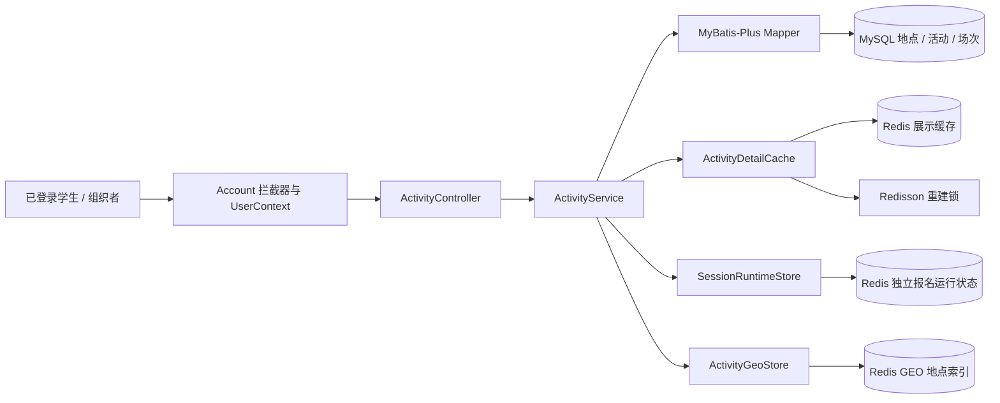
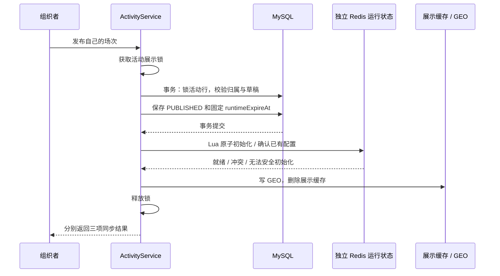

# Stage 2：Activity 学习与复现指南

本阶段把 Stage 1 的“已登录用户”接到一条真实业务链路：**组织者创建地点、活动与场次 → 发布 → 学生发现和查看活动**。报名受理和 MQ 消费仍在 Stage 3，本阶段不会生成报名或 PENDING。

## 1. 先理解三个业务对象

| 对象 | 负责什么 | 举例 | 不负责什么 |
| --- | --- | --- | --- |
| 地点 activity_location | 固定名称、地址、经纬度 | 学生活动中心 | 时间、容量 |
| 活动 activity | 组织者、固定地点、标题、介绍、封面 | 周末读书会 | 每一场的库存 |
| 场次 activity_session | 容量、报名窗口、举办时间、发布事实 | 周六下午场，30 人 | 用户登录态 |

一个地点可供多个活动使用，一个活动有多个场次。地点创建后不可编辑，活动地点固定；场次容量和时间只在草稿中编辑。这样发布后的承诺不会被悄悄更改。第一版没有地点删除、动态扩容、取消与退款。

发布以场次为单位。活动没有第二份独立发布状态：只要含已发布场次，就能被学生端查到；详情只返回已发布场次，组织者专用详情返回自己活动的全部场次。已结束场次仍保留 PUBLISHED 历史事实，不代表正在接受报名。



模块依赖仍是 Controller → Service → Mapper/Redis 组件。Controller 接收 DTO（接口专用输入输出），Service 处理角色、归属、事务和数据流；SQL 和 Redis 操作分别留在对应组件。Account 不调用 Activity。

## 2. 在已有 Stage 1 环境继续启动

使用 Java 21。先启动开发服务：

```powershell
docker compose up -d --wait
```

**已有 MySQL 数据卷不会重新执行初始化目录的 SQL。** 在根目录执行下面的一次性补建命令；它从已挂载的项目脚本创建缺失表，不删表、不清理用户，也不插入测试活动：

```powershell
docker compose exec -T mysql sh -c 'MYSQL_PWD="$MYSQL_PASSWORD" mysql -u"$MYSQL_USER" "$MYSQL_DATABASE" < /docker-entrypoint-initdb.d/01-schema.sql'
```

脚本为 CREATE TABLE IF NOT EXISTS，已存在的用户表不会被替换；它仅适用于当前已确认的 Stage 1 表结构，不是通用数据库迁移工具。全新数据卷首次启动会自动执行同一份 SQL，无需额外补建。不要为增加三张表删除数据卷。

随后启动应用：

```powershell
mvn spring-boot:run "-Dspring-boot.run.profiles=dev"
```

如果想观察缓存命中与回源：

```powershell
mvn spring-boot:run "-Dspring-boot.run.profiles=dev" "-Dspring-boot.run.arguments=--logging.level.com.campusbooking.activity.ActivityDetailCache=DEBUG"
```

只打开这个类的 DEBUG 即可。第一次查询记录 loaded from MySQL；后续命中记录 cache hit。默认配置为详情 10 分钟加 0～2 分钟随机 TTL、空值 30 秒、等锁最多 3 秒；app.activity 下可调整。Redisson 与 Lettuce 共用 spring.data.redis 的地址、端口、数据库及认证配置。

## 3. 跑通一条发布与查询链路

下面是 PowerShell 示例。先用开发组织者 13900000000 登录，再依次创建；日期由执行时间生成，不需要手动改固定日期。重复取码仍受 Stage 1 的 60 秒冷却限制。

```powershell
$base = 'http://127.0.0.1:8081'
$phone = '13900000000'
$receipt = Invoke-RestMethod "$base/api/account/code" -Method Post -ContentType 'application/json' -Body (@{phone=$phone} | ConvertTo-Json)
$login = Invoke-RestMethod "$base/api/account/login" -Method Post -ContentType 'application/json' -Body (@{phone=$phone; code=$receipt.data.devCode} | ConvertTo-Json)
$headers = @{Authorization="Bearer $($login.data.token)"}

function Invoke-ActivityJson($method, $path, $body) {
    $payload = [Text.Encoding]::UTF8.GetBytes(($body | ConvertTo-Json -Depth 8))
    Invoke-RestMethod "$base$path" -Method $method -Headers $headers -ContentType 'application/json; charset=utf-8' -Body $payload
}

$place = Invoke-ActivityJson Post '/api/organizer/locations' @{
    name='学生活动中心'; address='校园南门旁'; longitude=116.397; latitude=39.908
}
$activity = Invoke-ActivityJson Post '/api/organizer/activities' @{
    locationId=$place.data.id; title='周末读书会'; description='带一本喜欢的书，分享一个观点'
}
$activityId = $activity.data.id
$now = [DateTimeOffset]::UtcNow
$session = Invoke-ActivityJson Post "/api/organizer/activities/$activityId/sessions" @{
    capacity=30
    registrationStartAt=$now.AddHours(1).ToString('o')
    registrationEndAt=$now.AddHours(2).ToString('o')
    startAt=$now.AddHours(3).ToString('o')
    endAt=$now.AddHours(4).ToString('o')
}
$sessionId = $session.data.id
Invoke-RestMethod "$base/api/organizer/activities/$activityId/sessions/$sessionId/publish" -Method Post -Headers $headers

Invoke-RestMethod "$base/api/activities?page=1&size=10" -Headers $headers
Invoke-RestMethod "$base/api/activities/$activityId" -Headers $headers
Invoke-RestMethod "$base/api/activities/$activityId" -Headers $headers
Invoke-RestMethod "$base/api/activities/nearby?longitude=116.397&latitude=39.908&radiusKm=1" -Headers $headers

Invoke-ActivityJson Patch "/api/organizer/activities/$activityId" @{
    title='周末读书会：科幻专场'; description='分享一本科幻作品'
}
Invoke-RestMethod "$base/api/activities/$activityId" -Headers $headers
```

列表、详情和附近接口允许任意已登录角色，便于组织者检查发布结果。用一个新手机号按 README 登录，将 $headers 换成该 STUDENT 的 Token，再做相同查询；尝试发布应收到 403。不要把 Token 写进文档或截图。

### 接口表

全部业务接口需要 Authorization: Bearer token。

| 方法与路径 | 输入 / 作用 |
| --- | --- |
| POST /api/organizer/locations | name、address、longitude、latitude；组织者创建固定地点 |
| GET /api/locations?page=1&size=10 | 已登录用户分页查看地点 |
| POST /api/organizer/activities | locationId、title、description、可选 coverImage |
| GET /api/organizer/activities/{id} | 仅所属组织者，含全部草稿/已发布场次 |
| PATCH /api/organizer/activities/{id} | title、description、可选 coverImage；省略封面会清空旧封面 |
| POST /api/organizer/activities/{id}/sessions | capacity、registrationStartAt、registrationEndAt、startAt、endAt |
| PUT /api/organizer/activities/{id}/sessions/{sessionId} | 同上，完整替换草稿配置；发布后 409 |
| POST /api/organizer/activities/{id}/sessions/{sessionId}/publish | 发布或显式重试同一发布，不创建新场次 |
| GET /api/activities?page=1&size=10 | 仅含已发布场次的活动，按活动 ID 倒序 |
| GET /api/activities/{id} | 展示详情；不存在或仅有草稿返回 404，并缓存空值 |
| GET /api/activities/nearby | longitude、latitude、radiusKm（默认 5）、page、size |

page >= 1，size 为 1～50；附近半径 (0,50] 公里。经纬度使用 WGS84/Redis 坐标，longitude 在前、latitude 在后，纬度限制 ±85.05112878。封面只保存字符串，不上传或主动抓取远程图片。

时间使用带时区 ISO-8601，例如 2026-09-13T10:00:00+08:00；接收后转成 UTC 毫秒精度。必须满足：当前时间 < 报名开始 < 报名结束 <= 场次开始 < 场次结束。容量为 1～100000。

## 4. 重点一：发布事务与 Redis 初始化



为什么不把 Redis 放进数据库事务就结束？MySQL 的事务不能回滚 Redis。这里明确先保存事实，再同步；TransactionTemplate.execute 返回时已经完成提交，因此之后失败不能解释成“发布也回滚了”。

发布与草稿编辑都先锁定同一个活动行，避免读到 DRAFT 后，在别的请求发布完成后仍覆盖配置。数据库锁在事务结束后释放，Redisson 展示锁持有至同步与失效完成；它保护缓存写回顺序，不代替数据库业务约束。

| 发布返回 | 解释与处理 |
| --- | --- |
| 200，runtimeReady / geoReady / displayReady 均 true | 已完成本阶段发布准备；是否正在开放报名取决于时间窗口，实际报名接口留给 Stage 3 |
| 503，runtimeReady=false | MySQL 已保存并冻结；报名运行配置不完整、冲突或同步失败，暂不可报名 |
| 503，geoReady=false | 附近索引未同步；如果 runtimeReady=true，不应声称报名配置也失败 |
| 503，displayReady=false | 展示缓存未完成失效；旧展示可能存活至缓存 TTL，数据库事实已保存 |
| 409，报名开始时间已过且仍为草稿 | 初次发布被拒绝，需要先调整草稿时间 |
| 403 | 角色或资源归属不允许此操作 |

503 的返回体保留 sessionId、PUBLISHED 和每项同步状态。组织者可以显式重试原发布接口；不假装原发布回滚，不另建后台重试系统。若缺失运行键且已经进入报名期，显式重试也不能重建库存。

### Redis 各自的职责

| Key | 内容 | 生命周期 / 可否重建 |
| --- | --- | --- |
| campus:activity:detail:{activityId} | 学生端 JSON 详情或 null | 短 TTL；可查 MySQL 重建 |
| campus:activity:detail-lock:{activityId} | Redisson 管理的锁 | watchdog 续期；应用不手工操作锁值 |
| campus:activity:locations:geo | 地点 ID 与经纬度 | 无 TTL；发布时写入，可显式重复发布修复索引 |
| registration:session:{sessionId}:runtime | 独立配置、available、enabled、expireAt | 场次结束 + 发布时确定的缓冲期；禁止普通缓存回源 |
| registration:session:{sessionId}:users | Stage 3 的 userId → requestId | Stage 2 不创建或删除 |
| registration:request:{requestId} | Stage 3 的 PENDING | Stage 2 不创建或删除 |

runtime 包含 sessionId、activityId、capacity、registrationStartAt、registrationEndAt、sessionStartAt、sessionEndAt、expireAt、available、enabled。时间均为 epoch 毫秒。已有字段必须匹配，available 允许因预占下降；重复初始化不重置 available，不续期。

runtimeExpireAt 在发布时保存到 MySQL，再写入 Redis；即使未来应用把 buffer 从 24h 改为 48h，也不重算旧场次生命周期。Redis Lua 用服务端 TIME 判断尚未开放，避免在同步延迟跨过报名开始后仍创建缺失库存。应用与 Redis 仍应保持合理时钟同步。

## 5. 重点二：缓存完整生命周期

Cache Aside 是“先查缓存，未命中再查数据库并写回”。本项目分为：

```text
查 Redis
  ├─ 命中 JSON → 返回详情
  ├─ 命中 null → 返回 404
  └─ 未命中 → 等 Redisson 锁（最多 3 秒）
                → 再查缓存
                → 仍未命中才查 MySQL
                → 写 JSON + 随机 TTL，或 null + 30 秒
                → 释放锁
```

- **空值缓存**：同一个不存在的活动不会每次打到 MySQL，缓解缓存穿透；不能阻止不断换 ID 的请求。
- **随机 TTL**：分散不同活动集中失效；不保证所有热点请求都没有等待。
- **重建锁**：同一活动冷缓存并发请求中，首个请求回源，后续请求获得锁后复查缓存。超时返回 503，不无锁回源。
- **提交后失效**：展示修改和重建持有同一把锁，修改提交后删缓存；下一次查询再重建。正在执行的旧请求仍可能返回旧值，但旧回源不能在成功失效后污染新缓存。
- **代价**：Redis 不可用时查询/更新可能返回 503；写操作多了一次锁等待；数据库提交后进程崩溃或删除失败时，旧展示最多依赖 TTL 收敛。本阶段不承诺强一致缓存。

Redisson 使用不传固定 leaseTime 的 tryLock，让 watchdog 在持锁期间续期，避免固定短租期在慢查询中提前到期。它是面向当前单 Redis 拓扑的协作锁；故障转移、长暂停等问题不能靠该锁证明业务恰好一次。实现依据：[Redisson 锁文档](https://redisson.pro/docs/data-and-services/locks-and-synchronizers/)。本项目只引入 redisson 核心依赖，保持 Boot 管理的 Lettuce 不变。

详情中的 capacity 是场次总容量；remaining_capacity 是 MySQL 将来消费事务维护的事实，available 是 Redis 预占余量。展示缓存不承诺实时剩余量，也不能作为报名 Lua 的资格来源。

## 6. 重点三：附近活动与分页

GEO 索引保存地点，不直接保存每个场次。查询顺序：

1. Redis 按给定坐标、半径找地点，并返回距离。
2. MySQL 用地点 ID 过滤含已发布场次的活动。
3. 按地点距离顺序、活动 ID 倒序分页，再填入 distanceKm。

这样同一地点有多个活动时，不会因为先分页地点而漏掉活动。列表 total 统计活动数量，场次多不会把一个活动重复算多次。

当前实现会读取半径内全部地点，适合校园规模。城市级海量地点需再评估索引、分页和数据量上限；本阶段没有引入额外搜索服务。GEO 丢失不会触发报名库存重建；同步异常通过日志与发布结果暴露。

## 7. 阅读与亲自复现顺序

先只追踪“一个组织者发布一个场次”，再读缓存。无需一次读完全部文件。

| 顺序 | 文件（相对项目根目录） | 工程意义 | 可观察验收 |
| --- | --- | --- | --- |
| 1 | src/main/resources/db/schema.sql，activity/model | 搞清活动/场次关系及数据库约束 | 非法容量和时间不能落库 |
| 2 | activity/ActivityController.java，activity/dto | 确定外部能提交哪些字段 | 客户端不能传组织者 ID、发布状态或任意库存 |
| 3 | activity/ActivityService.java 的创建、编辑、publish | 理解角色、归属、事务、提交边界 | 自己能发布，跨组织者 403，发布后编辑 409 |
| 4 | activity/SessionRuntimeStore.java，redis/initialize-session.lua | 理解完整初始化、固定生命周期和幂等 | 重复发布不改变预占余量或绝对过期时间 |
| 5 | activity/ActivityDetailCache.java，config/ActivityConfig.java | 理解缓存 miss、空值、锁和失效 | 两次查询仅一次回源；更新后看到新标题 |
| 6 | activity/ActivityGeoStore.java，mapper/ActivityQueryMapper.java | 区分地理检索和业务过滤 | 半径外活动不出现，同地点多活动可翻页 |
| 7 | src/test/java/com/campusbooking/activity/ActivityFlowIT.java | 用真实依赖验证跨组件行为 | 隔离环境通过权限、并发、同步异常测试 |

复现时建议先亲自完成不带缓存的“创建 → 发布事实 → 查询”，再添加运行状态初始化，最后加详情缓存和 GEO。这样每次增加技术，都能说清它改变了哪段数据流。

学习优先级：

- 深入理解（10/10）：发布事务与 Redis 边界、重复初始化保护、缓存与报名状态分离；这些决定系统行为且可迁移。
- 深入理解（9/10）：业务表关系、权限归属、并发读写、缓存失效、测试输入与验收。
- 会用即可（7/10）：MyBatis-Plus API、GEO API、Redisson 配置、Bean Validation；遇到使用点再查。
- 交给 AI（3/10）：getter/setter、重复 DTO、请求样板。业务状态与错误语义需要自己能解释。

## 8. 验收与已知边界

```powershell
# 不需要外部服务：Stage 1 单元和请求生命周期测试
mvn -B -ntp test

# 隔离容器：全部测试、真实 HTTP 启动与健康检查、打包
mvn -B -ntp verify -Pintegration

# 仅关注 Activity 集成场景，仍运行普通单元测试
mvn -B -ntp verify -Pintegration "-Dit.test=ActivityFlowIT"
```

Testcontainers 为每个集成测试类创建临时 MySQL、Redis、RabbitMQ；测试清理语句只作用于这些临时容器。MockMvc 验证接口路径与拦截器，另有真实 HTTP 请求验证应用启动、依赖健康与活动详情。

重点观察：权限拒绝、草稿不可见、发布冻结、MySQL 提交后同步异常、重复发布保护、开放后缺失键拒绝重建、缓存命中/空值/TTL、12 个并发冷读仅一次活动回源、编辑与发布并发、展示更新与慢查询并发、附近半径和同地点活动分页。这些是正确性测试，不是吞吐量或压测结果。

正常启动不会自动补表、扫描 GEO 或重建报名库存。开发环境补表由你按第 2 节执行；本轮验收不会代替你清理或填充开发业务数据。第一版没有跨 MySQL/Redis 的全局事务，也没有后台自动恢复；同步失败必须按发布返回和日志理解。

完成本阶段后，你应能独立画出发布和详情查询两条链路，修改展示字段，添加一个草稿场次，并用返回值与数据库/Redis 状态证明结果。

思考题（最多三个）：

1. 为什么详情缓存丢失可以回源，而报名开始后的运行库存丢失不能直接从 MySQL 重建？
2. 为什么发布与草稿修改需要在同一数据库状态保护下执行？只在 Controller 检查 DRAFT 有什么问题？
3. 如果去掉“获得锁后再次检查缓存”，并发请求会怎样访问 MySQL？

