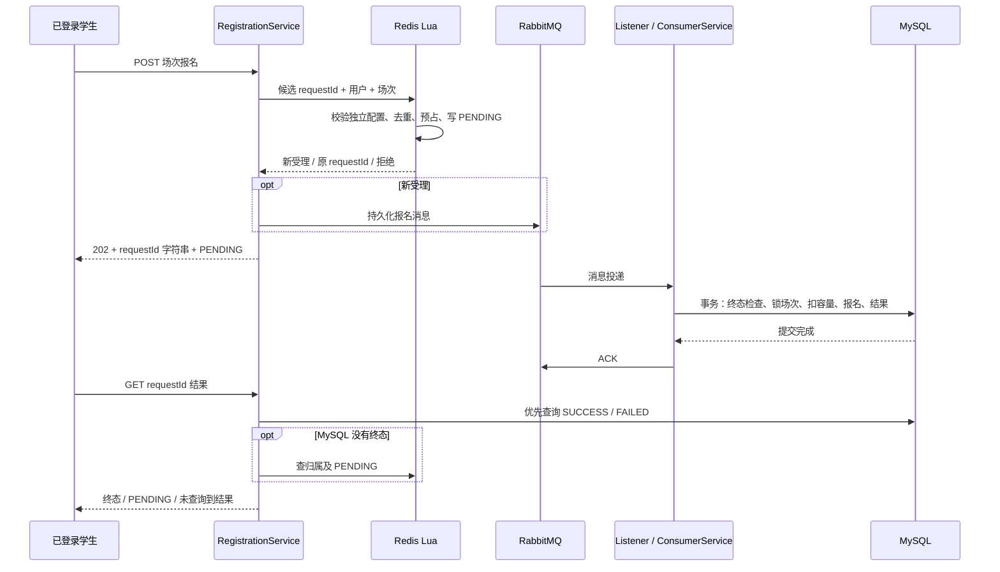

# Stage 3：Registration 学习与复现指南

本阶段让学生从“查看场次”走到“提交报名并查询最终结果”。最重要的区别是：**HTTP 202 表示受理，MySQL 的 SUCCESS 才表示报名成功。** 凭证及到场核验属于 Stage 4。

## 1. 一条链路与三份数据



| 存储 | 职责 | 数据保留 |
| --- | --- | --- |
| Redis 场次 runtime、users、request | 是否受理、可预占名额、去重、PENDING | 同一绝对期限：场次结束 + 发布时确定的缓冲期（默认 24 小时） |
| RabbitMQ 持久化消息 | 缓冲已经受理的请求，等待消费者处理 | 成功提交才 ACK；处理异常拒绝到基础死信队列 |
| MySQL registration、registration_result | 正式报名、不可改写的 SUCCESS / FAILED | 不随 Redis 过期删除 |

已有 `activity_session.remaining_capacity` 是 MySQL 的最终剩余容量。Redis `available` 是可预占名额，两者在异步处理中可以暂时不同。发生发送中断等故障后，也可能长期不同；第一版没有自动修复。

活动详情是展示缓存，不用于判断报名资格，也不承诺实时余量。Lua 只使用发布时初始化的独立运行配置。

## 2. 本阶段的文件与职责

所有 Java 路径均相对于 `src/main/java/com/campusbooking/`。

| 阅读顺序 | 文件 | 要理解的工程问题 | 深度 |
| ---: | --- | --- | --- |
| 1 | `registration/RegistrationController.java`、`RegistrationService.java` | 参数、角色、HTTP 202、重复请求、查询归属 | 深入 |
| 2 | `src/main/resources/redis/accept-registration.lua` | 为什么一次脚本内完成校验、去重和扣减 | 深入 |
| 3 | `registration/RegistrationRedisStore.java`、`RequestIdGenerator.java` | 显式 key、统一到期、ID 字符串及 UTC 序列 | 理解约束，会用 API |
| 4 | `config/RegistrationConfig.java`、`registration/RegistrationPublisher.java` | 队列、持久化、Confirm、不可路由与确认超时 | 深入流程 |
| 5 | `registration/RegistrationConsumerService.java`、`mapper/RegistrationMapper.java` | 事务、行锁、条件扣减、唯一约束、终态 | 深入 |
| 6 | `registration/RegistrationListener.java` | 提交后 ACK；技术异常进入死信，不伪造 FAILED | 深入 |
| 7 | `src/main/resources/db/schema.sql` | requestId 唯一、用户/场次唯一、终态 CHECK | 深入 |
| 8 | `src/test/java/com/campusbooking/registration/RegistrationFlowIT.java` | 如何以数据证明容量、幂等和故障边界 | 选择一条链路复现 |

调用关系仍然是 Controller → Service → Mapper/外部组件。Listener 是消息入口，事务规则留在 ConsumerService。Account 继续提供身份；Activity 继续管理配置和发布；模块职责没有互换。

## 3. 为什么这样设计

- **Lua 原子受理**：同一 Redis 实例串行执行脚本，多个学生竞争名额时，校验和扣减不会被其他请求插入。省掉 Lua 后若用多次独立命令检查再扣减，就可能超卖。脚本原子执行不等于失败自动回滚，因此先校验参数、数据类型、配置和到期边界，再写入。Redis 运行状态丢失时拒绝受理，不猜测库存。
- **MQ 缓冲流量**：HTTP 不等待 MySQL 报名事务。代价是需要查询最终结果，并接受暂态与最终事实的时间差。Confirm 只证明 broker 接收情况，不证明报名成功。
- **消费幂等**：同一消息再次到达仍产生同一业务结果。先查询终态，同一场次锁行后再查询一次；数据库两种唯一约束提供最后保护。不同 requestId 对同一用户/场次的重复报名保存明确失败。唯一冲突先回滚，再读已提交事实，技术异常不转换成 FAILED。
- **短事务与行锁**：当前实现提前锁住场次行，将同一场次的容量写入串行化。这比复杂的无锁冲突重试更容易学习、验证，代价是热点场次数据库写入吞吐量受限。事务采用 READ COMMITTED（每次读取可见当时已提交的数据），避免等待行锁后仍读到旧快照。
- **事务与操作边界**：消费事务超时 10 秒，MySQL 连接超时 3 秒、socket 超时 15 秒；MyBatis 使用 Spring 事务剩余时间作为语句超时。正式 runtime buffer 最小 1 小时、默认 24 小时，需留出时钟偏差。运行环境仍须保证时钟同步、连接与数据库超时正常工作，不能把进程或机器冻结解释成硬实时保证。
- **截止条件**：先复用既有终态；新事务以 MySQL 场次结束时间检查截止，扣容量 SQL 再以数据库当前时间检查。已经过期的消息不建成功报名；技术异常进死信，不把死信当成业务失败。
- **更简单的替代方案**：低流量下可以直接用 MySQL 事务同步报名。本项目使用 Lua + MQ 是为了学习限量受理和异步边界，不能把它描述成所有场景都必需的设计。

requestId 使用 `2026-01-01 UTC` 以来的秒数（高 31 位）与当日 Redis INCR（低 32 位）。计数器 key 不自动过期；单日超过 2^32−1 次或时钟超出范围会拒绝生成。多实例须共享 Redis 与 UTC 基准。生产计数器不能清空、回退或从旧备份单独恢复，否则可能 ID 重复；Redis AOF 也不代表任何故障都零丢失。本工具不是全局高可用 ID 平台。

Lua 使用 Redis 时间，消费检查使用应用 UTC 时钟并在扣减时再检查数据库时间。运行时应同步三者时钟。当前 key 布局使用单 Redis 实例，不支持直接切换 Redis Cluster 的跨槽 Lua。

## 4. 在已有 Stage 2 环境补表与启动

全新数据卷会由 Compose 自动运行 schema。已有数据卷需要手动补建两张报名表。下面脚本仅创建缺失表，适用于本项目已经确认的表结构；不是通用迁移工具。不删除开发数据卷。

```powershell
docker compose up -d --wait
docker compose exec -T mysql sh -c 'MYSQL_PWD="$MYSQL_PASSWORD" mysql -u"$MYSQL_USER" "$MYSQL_DATABASE" < /docker-entrypoint-initdb.d/01-schema.sql'
mvn spring-boot:run "-Dspring-boot.run.profiles=dev"
```

应用在当前配置的 RabbitMQ vhost 中声明 `registration.exchange`、`registration.queue` 和对应的 `registration.dead.exchange`、`registration.dead.queue`。消息持久化、队列持久化，mandatory 不可路由检测开启；消费者 2 个、每个 prefetch 20。死信没有自动重放消费者。

本轮实现与验收不在开发库执行补表。按 [Stage 2 指南](STAGE2_GUIDE.md) 创建并发布场次，等到报名开放后再提交；已经结束的旧场次不能用于新的报名。

## 5. 手动跑通接口

使用 Stage 1 登录获得**学生** Token。下面的 `$sessionId` 替换为已发布且处于报名窗口的实际场次 ID。

```powershell
$base = 'http://127.0.0.1:8081'
$sessionId = 1
$headers = @{Authorization='Bearer 替换为学生Token'}
$receipt = Invoke-RestMethod "$base/api/sessions/$sessionId/registrations" -Method Post -Headers $headers
$requestId = $receipt.data.requestId
$receipt.data
Invoke-RestMethod "$base/api/registrations/results/$requestId" -Headers $headers
Invoke-RestMethod "$base/api/registrations/me?page=1&size=10" -Headers $headers
```

| 接口行为 | 可观察结果 |
| --- | --- |
| 新受理 | HTTP 202；requestId 为字符串；status=PENDING |
| 重复提交 | 同一个 requestId；不再发消息、不再占位；查询接口显示最终事实 |
| 无名额 / 未开放 / 已关闭 | HTTP 409，FULL / NOT_OPEN / CLOSED |
| 运行状态缺失或损坏 | HTTP 503，RUNTIME_NOT_READY / RUNTIME_INVALID |
| 查询已有终态 | HTTP 200，SUCCESS 或 FAILED；SUCCESS 带 registrationId |
| 查询尚无终态的暂态 | HTTP 200，PENDING |
| 查不到 / 不属于当前用户 | HTTP 404，RESULT_NOT_FOUND，不泄露他人请求 |
| 查询依赖不可用 | HTTP 503，RESULT_UNAVAILABLE，保留原 requestId 稍后查询 |
| 我的报名 | 仅列正式成功报名；失败结果与 PENDING 不计入 |

我的报名返回场次关联，活动和场次详情仍由 Activity 提供；不额外复制展示数据。

## 6. 已知故障必须如实解释

1. **Lua 成功后、发送前宕机**：Redis 已预占而 MQ 没有消息。保持 PENDING，重复提交不补发，不自动归还名额。
2. **发送抛异常、否定确认、确认超时、不可路由**：保留原 requestId 和受理语义，日志关联 requestId。不创建 FAILED，也不承诺自动恢复。5 秒 Confirm 超时是观察阈值，不是 PENDING TTL。
3. **消费技术异常**：事务回滚；basicReject(requeue=false) 进入基础死信；不无限重新入队。常规持久化队列的死信转移本身不是端到端零丢失保证。
4. **提交后 ACK 前中断**：消息可能重投，已有终态保证不再次扣容量。提交结果不明时也不能凭连接异常认定 FAILED。
5. **Redis 过期或丢失**：先查 MySQL；都查不到只表示“未查询到结果”，不表示失败或名额已释放。

正式终态不再改写。第一版不增加 Outbox、自动重放、自动补偿或对账平台。可用性、容量利用率与实现复杂度之间的取舍应在面试中明确说明。

## 7. 验证与亲自复现

```powershell
mvn -B -ntp test
mvn -B -ntp verify -Pintegration
```

集成测试通过 Testcontainers 创建随机端口的临时 MySQL、Redis、RabbitMQ，不读取开发数据库作为夹具；需要 Docker Desktop 的 Linux 引擎。测试关闭应用上下文后自动回收临时容器。实际验收结果以 [方案第 10 节](PROJECT_PLAN.md#10-当前交付状态) 为准。

建议按以下顺序亲自复现，不要一次抄完所有文件：

| 步骤 | 动手目标与工程意义 | 验收结果 |
| --- | --- | --- |
| 1 | 定义正式报名与终态表，先表达业务不变量 | 同一用户/场次重复插入被唯一约束拒绝，PENDING 不能写入结果表 |
| 2 | 实现 Lua 与 ID，明确受理边界 | 30 个不同用户争 5 个名额，只有 5 条新 PENDING；20 次同用户请求只占一次 |
| 3 | 实现 ConsumerService，先理解数据库事实 | 重复执行同一消息只扣一次；强制结果插入失败后容量和报名全部回滚 |
| 4 | 接入 Publisher 与 Listener，将入口和事务职责分开 | 消费成功才 ACK；技术异常进入死信且无 FAILED 伪终态 |
| 5 | 完成接口、查询和日志 | 202 能拿到字符串 ID；终态覆盖 PENDING；他人不能查询；发送异常不会要求重建请求 |

这些并发测试验证正确性，不代表 QPS 或 Stage 5 的 500/1000/2000 并发压测结果。

学习优先级：数据流与事务边界 10/10、幂等与数据库约束 10/10、Lua 原子性 9/10、异步状态和故障语义 9/10；框架注解、RabbitMQ 声明 API 学会使用即可；重复 DTO、固定样板及格式整理可交给 AI。

自测三个问题：为什么 202 后仍不能显示报名成功？为什么数据库事务成功后才能 ACK？为什么不能删除过期 PENDING 后就认为名额已经归还？能结合实际 Redis、消息和数据库记录解释，才算掌握本阶段。
