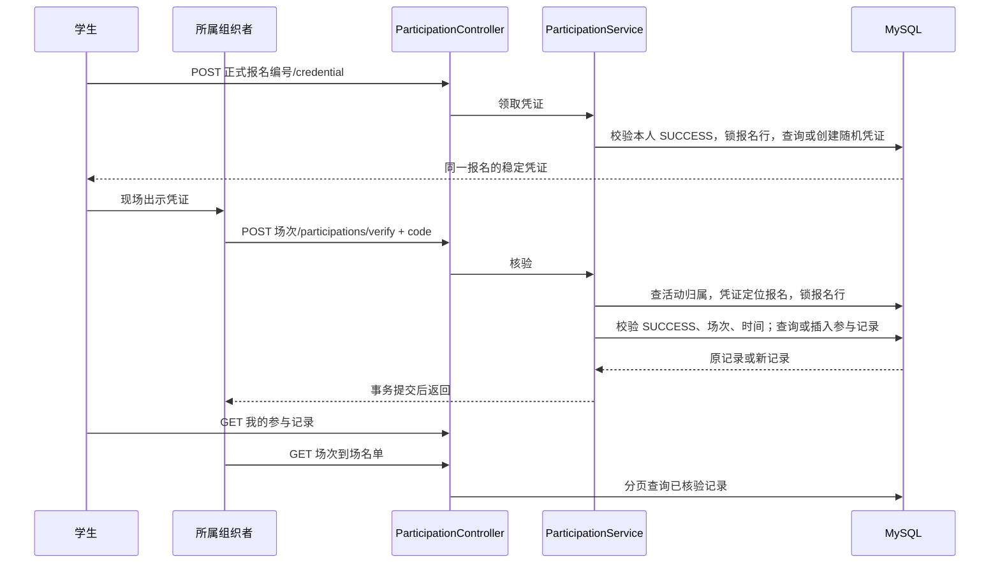

# Stage 4：Participation 学习与复现指南

本阶段把“报名成功”接到“实际到场”。报名 SUCCESS 是取得名额的事实；参与记录是组织者核验到场的事实。二者分别保存，核验不会改写 requestId 的终态，也不会再次扣容量。

## 1. 数据流和模块边界



Account 提供登录身份，Activity 提供活动归属和冻结的场次时间，Registration 提供正式报名及 SUCCESS 事实。Participation 自己负责凭证和到场核验。Controller 只接收参数，Service 决定业务规则和事务，Mapper 执行 SQL；没有新增 Redis 状态或 MQ 消息类型。

| 数据 | 关联与约束 | 作用 |
| --- | --- | --- |
| `participation_credential` | `registration_id` 主键兼报名外键；`code` 唯一且区分大小写 | 一份正式报名只对应一个凭证 |
| `participation_record` | `registration_id` 主键兼凭证外键；`checked_by` 用户外键 | 同一报名最多产生一条到场事实，保留核验人和首次核验时间 |

用户、场次从正式报名关联查询，不在参与表重复保存，避免不同表中的归属互相矛盾。SUCCESS 与报名的 requestId、用户、场次和报名编号全部匹配后才允许操作；数据库外键负责防孤立记录，角色、归属、时间与成功状态由服务负责。

## 2. 已确定的规则与取舍

- **领取资格**：仅已登录学生可以领取自己的成功报名凭证。使用 SUCCESS 返回的 `registrationId`，不是 requestId。PENDING、FAILED 或他人的报名不能领取。领取不等于到场；场次结束后仍可取得历史凭证，但不能再核验。
- **凭证形式**：随机 UUID 去掉连字符，得到 32 位小写十六进制码。通过 POST 首次创建，重复领取返回同一码；现有 Stage 3 成功报名也适用，无须批量回填。使用 POST 是因为第一次领取会写数据库。没有二维码图片、轮换或独立凭证平台。
- **核验资格**：必须是 ORGANIZER，且是该场次所属活动的组织者。请求携带场次编号，错误场次的凭证不能误核验。仅有组织者角色并不意味着可以管理所有活动。
- **核验时间**：用户于 2026-09-24 确认按 `[startAt, endAt)` 执行。取得报名行锁后检查应用 UTC 时钟：开始时允许，结束时拒绝。不提前 30 分钟，也不额外延长窗口。运行环境应保持时钟同步；检查通过的短事务可能稍后提交，`checkedAt` 记录检查时刻。
- **重复核验**：先检查角色、归属、成功事实与时间，再查旧记录。窗口内重复调用返回首次的 `checkedBy`、`checkedAt`；窗口外即使已经核验也返回 409，历史事实仍可通过列表查询。
- **事务与并发**：用 `SELECT ... FOR UPDATE` 锁住这一条报名，让同一报名的并发领取/核验依次执行。READ COMMITTED 表示每次读取看到当时已经提交的数据，等待锁后能读到上一请求写入的记录。数据库主键约束提供最终防重保护。事务超时 10 秒，沿用已有连接和操作超时。
- **为什么不加分布式锁**：写入都在同一 MySQL 中，数据库行锁和唯一约束足够表达规则。代价是同一报名上的请求需要等待；锁的粒度是报名，不是整个场次。更简单的低并发演示也不能只做“先查再插”而去掉数据库唯一约束。
- **故障语义**：写入失败回滚，技术异常返回既有 503 语义，不伪造核验成功。若提交已成功但响应丢失，可在窗口内重试或查询名单确认；重试不会生成第二条事实。
- **展示与限制**：我的参与记录、到场名单只列已核验者；没有到场记录不自动等于缺席。列表返回昵称、用户/场次/报名编号及核验人、时间，不返回手机号或凭证码。活动标题和昵称是当前值，不是历史快照。列表总数与分页查询不是同一快照，核验进行中可能暂时不同。凭证可被持有人转发，不能单独证明现实身份；第一版没有动态防转让机制。日志不输出完整凭证。

## 3. 接口与手工复现

所有业务接口均需要 `Authorization: Bearer <token>`，沿用统一 ApiResponse 格式。

| 接口 | 身份 | 输入与输出 |
| --- | --- | --- |
| `POST /api/registrations/{registrationId}/credential` | 报名所属学生 | 无请求体；200 返回 `registrationId`、`code`，重复返回原码 |
| `POST /api/sessions/{sessionId}/participations/verify` | 所属组织者 | `{"code":"32位小写十六进制码"}`；200 返回参与记录 |
| `GET /api/participations/me?page=1&size=10` | 学生 | 自己的参与记录分页 |
| `GET /api/sessions/{sessionId}/participations?page=1&size=10` | 所属组织者 | 场次到场名单分页 |

分页从 1 开始，每页 1～50 条，按核验时间、报名编号倒序。错误：400 参数错误，401 未登录，403 角色或活动归属不符，404 未找到可用报名/凭证/场次，409 不在核验窗口，503 数据库暂不可用。

先按 Stage 2 创建并发布场次，再按 Stage 3 完成一次报名并查到 SUCCESS。用学生 Token、所属组织者 Token 分别设置 `$studentHeaders`、`$organizerHeaders`，取实际 `registrationId` 和 `sessionId`：

```powershell
$base = 'http://127.0.0.1:8081'
$studentHeaders = @{Authorization='Bearer <学生 token>'}
$organizerHeaders = @{Authorization='Bearer <所属组织者 token>'}
$registrationId = <SUCCESS 返回的 registrationId>
$sessionId = <报名所属场次 id>
$credential = Invoke-RestMethod "$base/api/registrations/$registrationId/credential" -Method Post -Headers $studentHeaders

# 等到场次开始，再核验；不要修改已发布场次的时间来绕过规则。
$body = @{code=$credential.data.code} | ConvertTo-Json
Invoke-RestMethod "$base/api/sessions/$sessionId/participations/verify" -Method Post -Headers $organizerHeaders -ContentType 'application/json' -Body $body
Invoke-RestMethod "$base/api/participations/me" -Headers $studentHeaders
Invoke-RestMethod "$base/api/sessions/$sessionId/participations" -Headers $organizerHeaders
```

准备手工实验时可以把场次安排在几分钟后，留足发布、报名及异步处理时间；公开 API 不提供推进时钟接口。不要把真实凭证写进日志或提交到仓库。

## 4. 从已有 Stage 3 环境补表

全新 Compose 数据卷自动执行 schema。已有开发数据卷启动时不会自动补表，需在你选定的开发环境手动执行以下建表脚本；本阶段 Agent 验证只使用隔离容器，没有修改开发数据库。

```powershell
docker compose up -d --wait
docker compose exec -T mysql sh -c 'MYSQL_PWD="$MYSQL_PASSWORD" mysql -u"$MYSQL_USER" "$MYSQL_DATABASE" < /docker-entrypoint-initdb.d/01-schema.sql'
mvn spring-boot:run "-Dspring-boot.run.profiles=dev"
```

脚本为 `CREATE TABLE IF NOT EXISTS`，已有 Stage 1～3 表保持不变，新增两张 participation 表；不删除数据卷。这不是通用数据库迁移工具，不会自动修正人为改过的旧表结构。

## 5. 学习与复现路线

目标：独立实现“凭证关联成功报名、所属组织者核验、同一报名只记一次到场”，并能说明数据库约束和应用规则分别保护什么。

| 顺序 | 文件 | 亲自实现的重点 | 验收 |
| ---: | --- | --- | --- |
| 1 | `src/main/resources/db/schema.sql` | 两张表的主键、唯一键与外键 | 重复或孤立记录被数据库拒绝 |
| 2 | `src/main/java/com/campusbooking/participation/mapper/ParticipationMapper.java` | SUCCESS 关联、锁报名行和名单查询 | 查询只对应同一正式报名；锁粒度可解释 |
| 3 | `src/main/java/com/campusbooking/participation/ParticipationService.java` | 领取、权限、时间、事务和幂等 | 12 个并发请求仍只有一个凭证、一条参与事实 |
| 4 | `src/main/java/com/campusbooking/participation/ParticipationController.java`、`ParticipationViews.java` | 输入输出与 HTTP 语义 | 未登录、参数错误、业务拒绝可区分 |
| 5 | `src/test/java/com/campusbooking/participation/ParticipationFlowIT.java` | 隔离数据、固定时钟、异常回滚、并发 | 无需等到现实中的场次开始也能验证边界 |

先建立数据不变量，再写业务规则，最后接入 HTTP，这样每一步都有明确的输入、输出和可观察结果。优先深入学习权限归属、事务与幂等（10/10），测试边界（9/10）；MyBatis 注解和参数校验 API 会使用即可，重复数据类可交给 AI。

```powershell
mvn -B -ntp test
mvn -B -ntp verify -Pintegration
```

集成测试创建临时 MySQL、Redis、RabbitMQ，在随机端口启动真实应用，关闭上下文后自动回收容器。实际执行时间、数量和结果见 [方案第 10 节](PROJECT_PLAN.md#10-当前交付状态)。并发测试是正确性验证，不是 Stage 5 压测。

自测三个问题：为什么组织者角色还不够？为什么不能把 SUCCESS 改成 CHECKED_IN？为什么两个并发请求都“先查没有记录”时仍需要行锁和唯一约束？能用数据库记录与测试结果回答，才算掌握本阶段。
